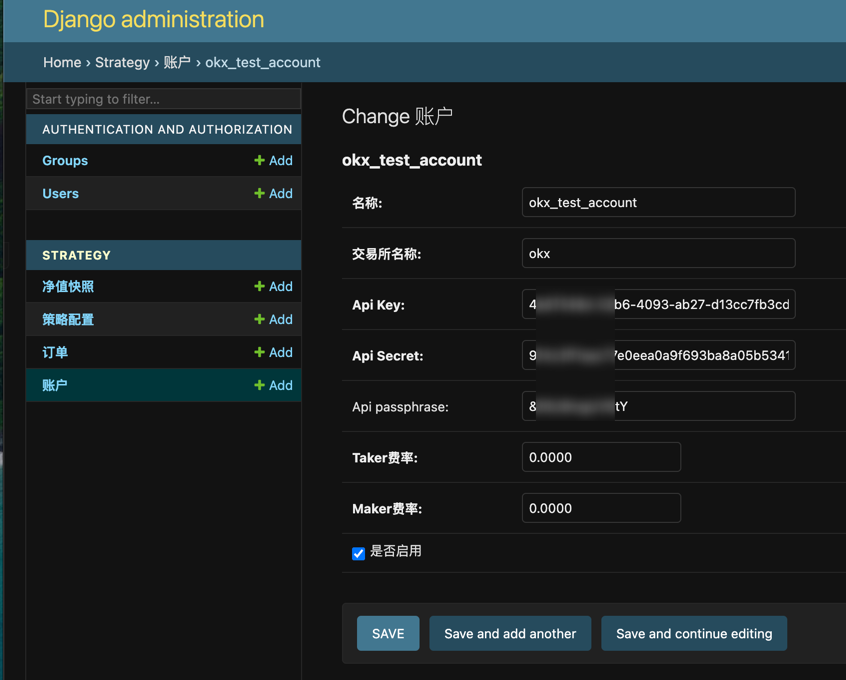
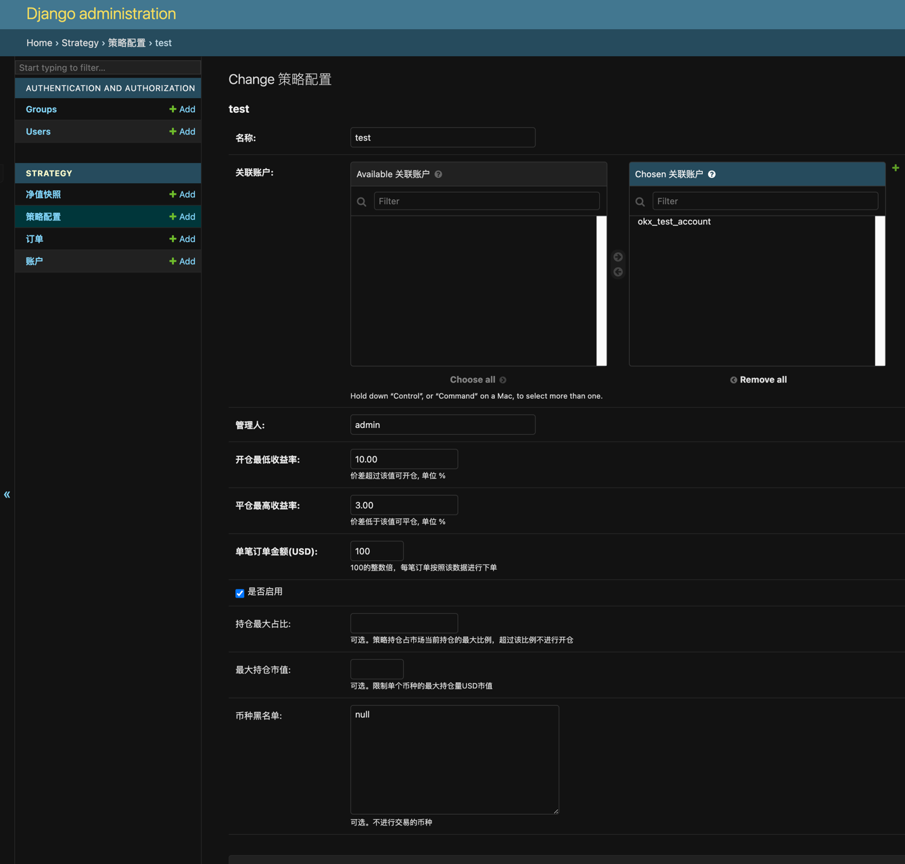
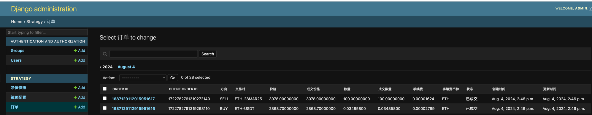

<h1 align="center">
  <br>okx_spot_future_arbitrage<br>
</h1>

中文 | [English](README.md) 


# 介绍
期现套利： 期现套利是指当同币种的期货和现货存在较大价差时，通过买入低价方、卖出高价方，当两者的价差缩小时进行平仓，即可收获价差缩小部分利润  

市场采用 OKX 现货杠杆和币本位合约
* 现货杠杆下单
* 币本位交割合约对冲

年化收益率 = (future_price - spot_price) / spot_price / future_expire_days * 365 * 100%  

收益率参考 https://www.okx.com/zh-hans/markets/arbitrage/spread-usd

# 说在前面
1. DYOR (DO Your Own Research)
2. 在正式使用策略前，建议先在模拟盘中进行测试，确认策略的稳定性和收益率


# 准备工作：
* 账户改为跨币种保证金 (升级至跨币种保证金模式，要求交易账户中权益不低于 10,000.00 USD)

# 策略核心逻辑
1. 策略模块中通过ws实时获取当前仓位和资金余额
2. 获取数据处理模块获取实时收益率排名
3. 开仓逻辑：
   1. 按序处理收益率排名中的交易对
   2. 判断数据是否超时（大于制定时间，比如10s)
      1. 超时则跳过
   3. 检查当前是否允许开仓
      1. 策略是否开启
      2. 现货USDT是否充足（balance > per_order_usd)
      3. 仓位是否达到上限
      4. 收益率是否达标
   4. 两腿下单
      1. 简单逻辑均为超价限价单，比如spot，以asks[5]为买价，future 以 bids[5] 为卖价
      2. 复杂逻辑：
       1. 现货maker，等ws成交消息过来后再下单合约taker，价格同上。风险点在于价格滑动过快
          3. 精度处理
       1. 现货和合约的价格精度，根据市场数据来处理
       2. 现货size精度需要根据市场数据来处理
4. 平仓逻辑
   1. 遍历当前持仓，获取对应的收益率，收益率低于平仓阈值的进行平仓处理
   2. 平仓操作亦是两腿下单，同时操作。


# 项目部署

###  dependent components:
  - redis = 6.x     (e.g. 6.2.6)
  - mysql = 8.0.x    (e.g. 8.0.31)
### env up

####  create mysql database or using make setenv auto create db
```
DROP DATABASE basis_alpha_db;
create database basis_alpha_db charset=utf8mb4;
```

#### install requirements

```
pip install -r requirements.txt
pip install -r requirements-dev.txt
```


####  initial default data
* 创建管理后台用户
```
python manage.py createsuperuser --role=admin
```
* 初始化数据库表格
```
python manage.py migrate
```

####  配置账户
访问 http://localhost:8000/admin/strategy/account/add/ 添加账户  
注意Api Secret字段需要使用加密后的密文，使用tools/aes_encrypt.py进行加密    



添加策略配置  


####  服务启动
* 配置环境变量 
测试环境（模拟盘）
```
export PROFILE=dev
```
正式环境
```
export PROFILE=production
```
* 管理后台（账户管理、策略配置、订单管理）
```
python manage.py runserver
```

* 市场数据模块
```
python manage.py start_okx_future_spot_spider
```
* 策略模块
```
python manage.py start_strategy --strategy_name test --account_name okx_test_account
```

观察订单成交情况


### FAQ
## how to install mysqlclient
Exception: Can not find valid pkg-config name.

Install MySQL client and pkg-config using Homebrew:
brew install mysql-client pkg-config

Set the PKG_CONFIG_PATH environment variable:
export PKG_CONFIG_PATH="$(brew --prefix)/opt/mysql-client/lib/pkgconfig"

Install the mysqlclient package using pip:
pip install mysqlclient==2.2.4
